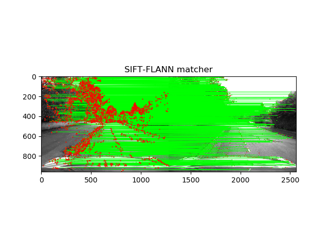
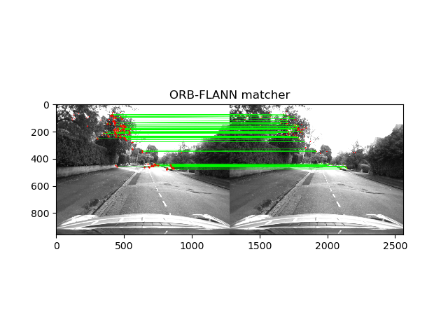
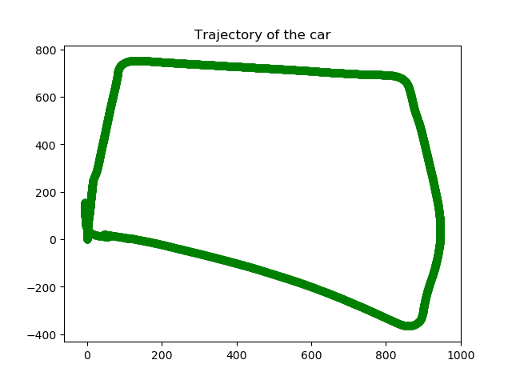

		Project 5 Submission - ENPM673 - Perception for Autonomous Robotics
 	

 	

 	
	

TEAM
------
    Ashwin Prabhakar
    Govind Ajith Kumar
    Rajeshwar N S 

Submission date : 
------
    4th May- 2020
-------------------------------------------------------------

YOUTUBE VIDEOS
------

    https://youtu.be/Awa_ivgOmE0
    https://youtu.be/D0Xwt2t3DMI
    https://youtu.be/abnfoyUnfcA
   
GITHUB
------

    https://github.com/govindak-umd/ENPM673/tree/master/Project%205

GOOGLE DRIVE
------

    https://drive.google.com/file/d/1sJ3NfOpi9GpRE913XT3-L9ipRHenuMMs/view?usp=drivesdk
-------------------------------------------------------------

						There are  5 codes attached with one sub-directory 
The codes in .py files are as follows:

read_images.py (data set preperation and conversion of image folder to .npy)

	NOTE: THIS HAS TO BE RUN, OR ELSE, PLEASE DOWNLOAD THE .npy dataset FROM THE GOOGLE DRIVE LINK (),
	SO THAT THE OTHER TWO CODES CAN RUN. THE DATA SET IS 4.4GB  AND HENCE, COULDN'T BE ATTACHED.
	
builtin_structure_motion.py (Code for visual odometry using built in functions)

Original_stereo.py (Code for visual odometry using user defined functions)

Other two codes are supplied with the dataset itself.

ReadCameraModel.py
UndistortImage.py

-------------------------------------------------------------
Directories are:

	PLace a folder called 'Output'. This is where the images will get populated.
	So the third code (Original_stereo.py) will over write the images populated
	by the second code. (builtin_structure_motion.py )

Software used:
------

    Python 3.7
    OpenCV - contrib- 3.4.2

	Please note that there has to be SIFT (xfeatures2d) installed in the system

Libraries
------
  import cv2  
  import numpy as np 
  import matplotlib.pyplot as plt 
  from ReadCameraModel import * 
  from UndistortImage import * 
  import random 
  import time 

____________________________________________________________________________________________________________________________________
